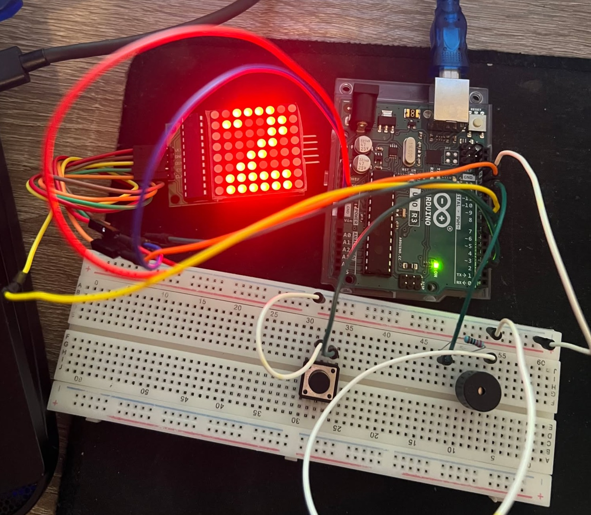
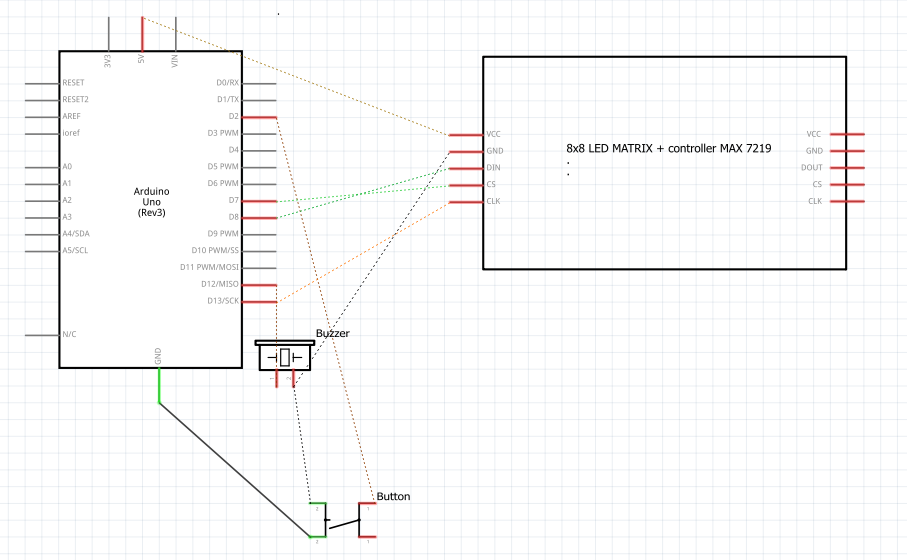
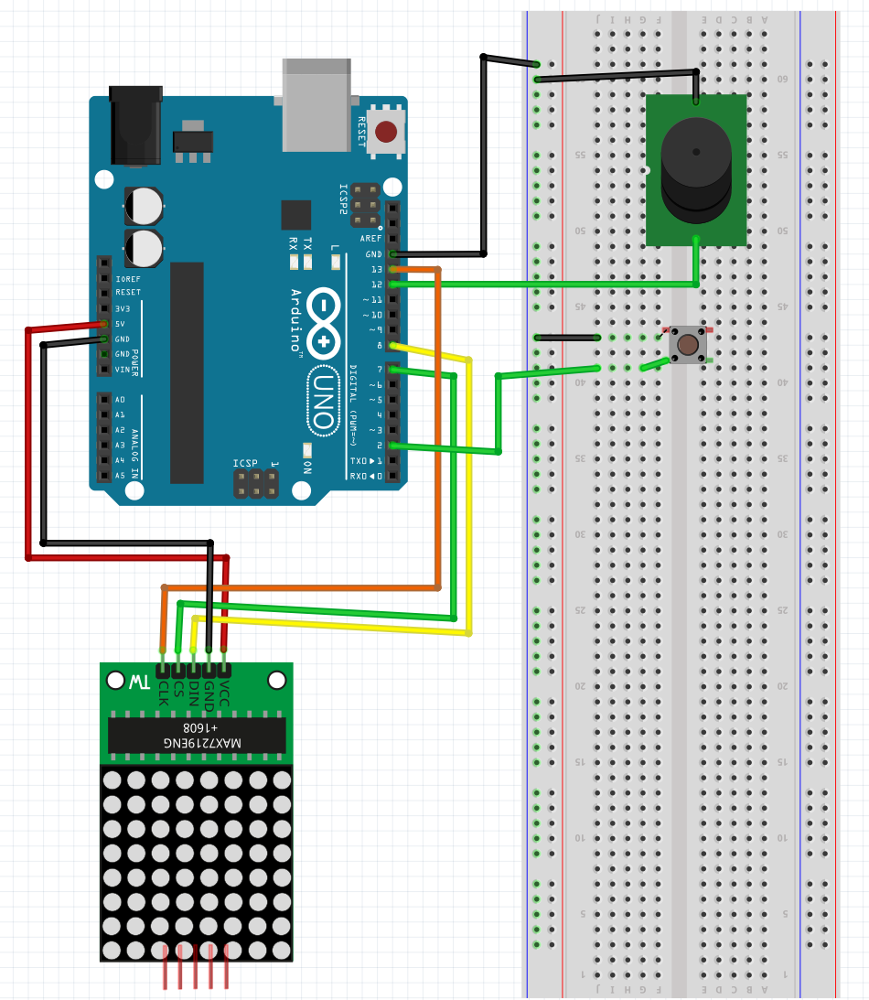

# Arduino powered Do-re-mi machine :)

## Problem
Building of asynchronous, event-driven tone player with Arduino which leverages the inbuilt ISR timer, timer interrupts, one external(hardware interrupt) & storage in EEPROM memory.

## Schematics

## DEMO

https://github.com/user-attachments/assets/0665bf44-7afb-441a-963f-9505a3e0d4a1

[View uncompressed mp4](././illustrations_and_extras/DEMO.mp4)
## Design

#### 1. **Timer-based**
- Uses Timer1 with CTC (Clear Timer on Compare) mode for  1ms timing
- Millisecond counter provides timing base for note playing & gaps in between

#### 2. **Musical note sequence**
The system plays a Do-Re-Mi sequence with an optional note:
- **Do (C4)**: 262 Hz, 400ms duration
- **Re (D4)**: 294 Hz, 400ms duration  
- **Mi (E4)**: 330 Hz, 400ms duration
- **Optional Note (Button)**: 600 Hz, 1000ms duration
- 300ms silence between notes in the three note sequence

#### 3. **Visual user feedback**
- MAX7219-controlled 8x8 LED matrix display shows corresponding number (1, 2, 3, 4) for each note (including 4th)

#### 4. **EEPROM statistics tracking**
- storage of play counts for all 4 notes (3 sequence + 1 optional)
- 2-byte (16-bit) counters per note 
- Counters stored at addresses 2-3, 4-5, 6-7, 8-9
- Saves to EEPROM after each complete Do-Re-Mi cycle
- Optionally reads counts on startup to preserve history across power cycles

### State Machine
The main loop operates as a state machine with three states:
1. **PLAYING NOTE** (`in_gap = 0`): Active tone generation with countdown
2. **GAP/SILENCE** (`in_gap = 1`): 300ms silence between notes
3. **BUTTON INTERRUPT**: Immediate special note

## Parts List
List of components used in the project:
| Quantity | Component                |
|----------|--------------------------|
| 1        | Arduino Uno R3           |
| 1        | Buzzer                   |
| 1        | 1 kΩ Resistor           |
| 1        | Button                   |
| 1        | MAX7219-controlled 8x8 LED matrix |

## EEPROM layout
| Address | Size | Content              |
|---------|------|----------------------|
| 2-3     | 2 bytes | Note 1 play count |
| 4-5     | 2 bytes | Note 2 play count |
| 6-7     | 2 bytes | Note 3 play count |
| 8-9     | 2 bytes | Note 4 play count |

## ISR roles

### 1. Timer1 Compare Match ISR (`TIMER1_COMPA_vect`)
-  Timer1 is configured with a 64 prescaler (16MHz/64 = 250kHz) and compare value OCR1A = 249 to generate interrupts every 1ms
    - Increments `ms_count` for global timing
    - Sets `tick_1ms` flag to signal the main loop

### 2. External Interrupt ISR (`onButtonISR`)
- FALLING edge detection when button is pressed and released, signal goes from high to low.    
    - Sets `button_flag` to signal main loop to play special note
    - Allows interrupting the Do-Re-Mi sequence at any time
## Demo

## Future Improvements
- **Additional buttons**: Add multiple buttons to trigger different special notes or melodies
- **Volume control**: Implement a potentiometer for adjustable buzzer volume
- **Custom melodies**: Allow users to program their own note sequences via hardware inputs
- **Visual animations**: Create scrolling or animated patterns on LED matrix between notes

