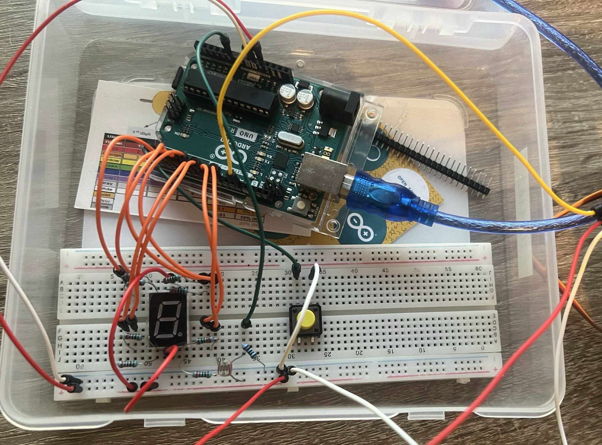
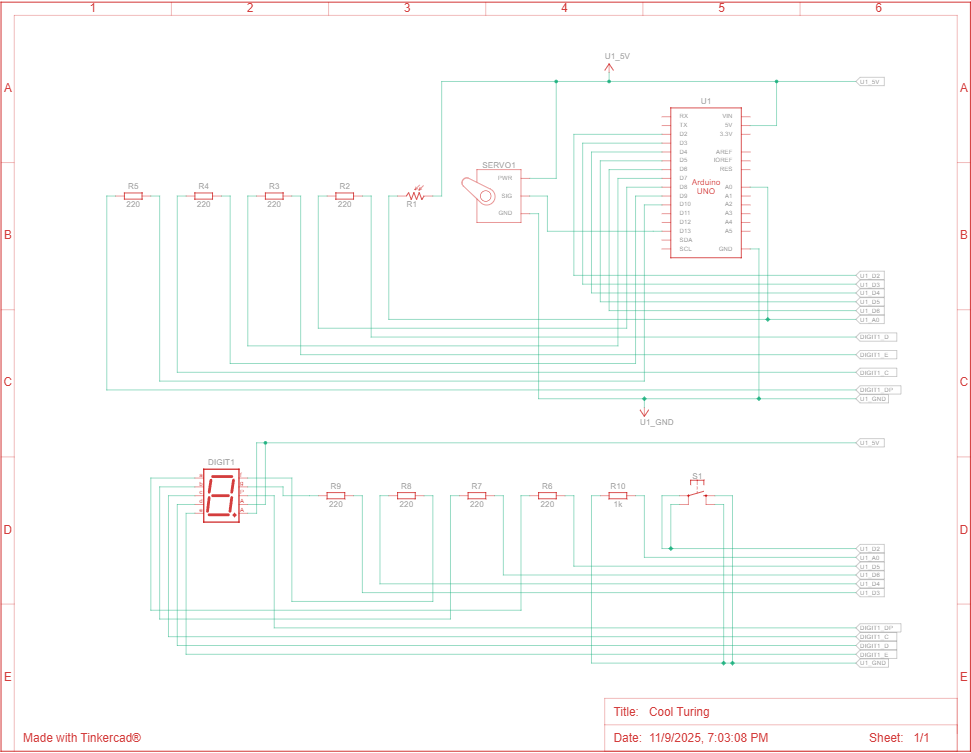
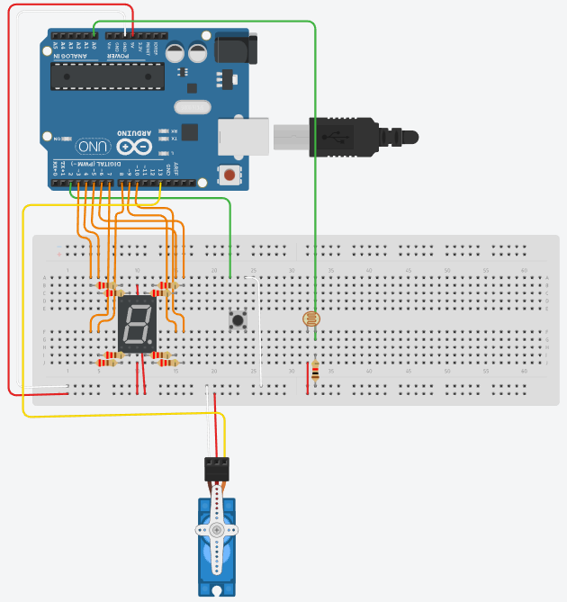

# Arduino powered light controller gate + manual override

## Problem
Building of asynchronous, event-driven servo gate controlled by a light sensor or manual override with Arduino. It  leverages the inbuilt ISR timer, timer interrupts, one external(hardware interrupt) & storage in EEPROM memory.
## Schematics

## DEMO

[View uncompressed mp4](././illustrations_and_extras/DEMO.mp4)
## Design
1. Timer-based
  - Uses Timer2 in CTC mode to generate a 1ms system tick. (Timer2 was chosen, as Timer1 is utilized by the servo.h library and could cause interference).
  - Millisecond counter provides timing base for reading values from light sensor and updating servo angle if light threshold is met.

2. Light-based auto gate control
  - Reads the photoresistor value every set amount of ms (SAMPLE_MS).
  - Maps light level (0–1023) to a digit 0–9 using a constrain function and shows it on a common-anode 7‑segment display using a segment mapping display array and function.
  - If light levels surpass the set threshold (LIGHT_OPEN_THRESHOLD), updates the servo angle to 180° (opens the gate); otherwise updates it to starting angle (closes the gate).
  - Tracks max observed light (light_max_value) & gate open count only on transitions closed->open (gate_open_counter)

3. Manual override (button)
  - Button press  on FALLING edge with 50ms debounce triggers manual ISR.
  - The main loop processes the button flag: opens the servo immediately, displays a special symbol (DIGITS[11])  and  holds it open for set amount of sample intervals(intervals_to_keep_open).
  - The open count(gate_open_counter) increments only on transitions closed->open.

4. EEPROM statistics tracking
  - Persists (save_to_eeprom):
    - Gate open count.
    - Maximum light level.
  - On startup optionally reads values from EEPROM (read_from_eeprom).

5. State Machine
    1. BUTTON OVERRIDE: If button_flag is set, open servo, show special symbol, start forced-open window.
    2. WAIT WINDOW: While remaining_Ms > 0, count down without resampling.
    3. MEASURE & OPTIONALLY OPEN/CLOSE GATE: Read light, update display, open/close servo based on threshold, update statistics, and persist to EEPROM.

6. Debug output
    - Prints light level, shown digit, max light, and open count to serial 9600

## Parts List
List of components used in the project:
| Name   | Quantity | Component                                   |
|--------|----------|---------------------------------------------|
| U1     | 1        | Arduino Uno R3                              |
| S1     | 1        | Pushbutton                                  |
| Digit1 | 1        | Anode 7 Segment Display (5011BS)            |
| SERVO1 | 1        | Positional Micro Servo (SG90)               |
| R1     | 1        | Photoresistor                               |
| R2, R3, R4, R5, R6, R7, R8, R9 | 8 | 220 Ω Resistor            |
| R10    | 1        | 1 kΩ Resistor                               |

## EEPROM layout

| Address | Size    | Content                 |
|---------|---------|-------------------------|
| 2-3     | 2 bytes | Gate open counter       |
| 4-5     | 2 bytes | Maximum light level     |

## ISR roles

### 1. Timer2 Compare Match ISR (`TIMER2_COMPA_vect`)
- Timer2 is configured in CTC mode with a 64 prescaler and compare value `OCR2A = 249` to generate a 1 ms interrupt tick.
    - Increments `ms_count` (millisecond counter) for global timing reference.
    - Sets `tick_1ms` flag so the main loop executes its time‑based state logic once per ms.

### 2. External Interrupt ISR (`onButtonISR`)
- Triggered on the pushbutton FALLING edge.
    - Performs 50 ms debounce.
    - Updates `last_bnt_ms` to current `ms_count` when accepted.
    - Sets `button_flag` signaling the main loop to immediately force gate open, display special symbol, and start the timed override window.

## Future Improvements
- **Adjustable thresholds**: Add user-configurable open/close light thresholds with buttons
- **Startup auto-calibration**: Sample ambient light for a few seconds on boot to set baseline and/or dynamic thresholds.
- **Heartbeat with DP segment**: Heartbeat indicator: Blink the DP segment every second to show the system is alive.
- **Button long-press actions**: Long press to reset stats (max light, open count).

