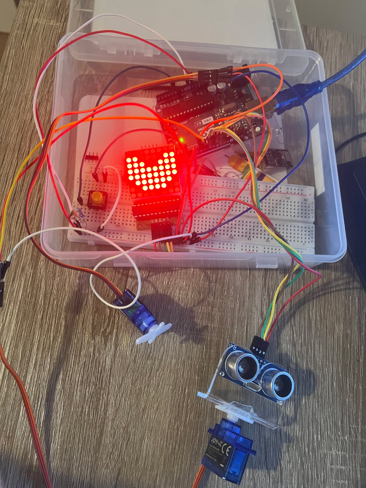
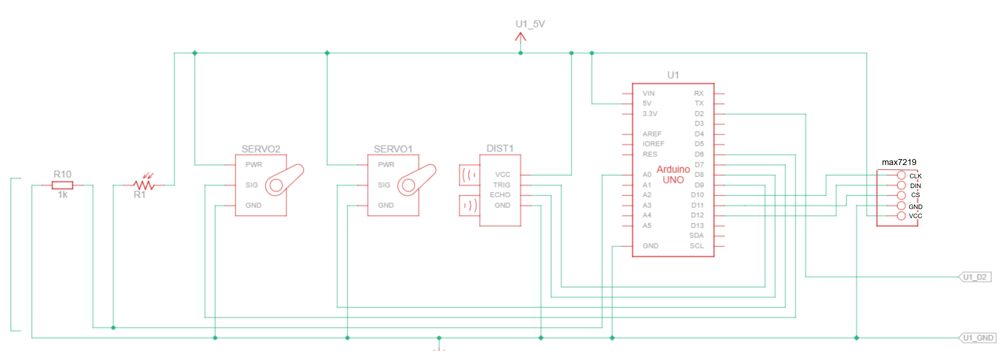
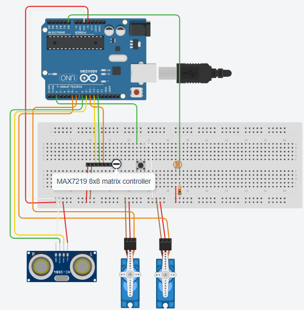

# Arduino powered light controller gate + manual override

## Problem
Building of an asynchronous, event-driven servo gate controlled by a light sensor or manual override with Arduino. It  leverages the inbuilt ISR timer, timer interrupts, one external(hardware interrupt) & storage in EEPROM memory. Has to be more advanced than lab_3.

## Schematics

## DEMO

<!-- [View uncompressed mp4](././illustrations_and_extras/DEMO.mp4) --> -->
## Design

#### 1. **Timer-based**
- Uses Timer2 in CTC mode to generate a 1ms system tick with a 64 prescaler and compare value `OCR2A = 249`.
- Millisecond counter (`ms_count`) provides timing base for light sampling, servo updates, ultrasonic measurements, and alert animations.

#### 2. **Three-state radar system**
The system operates in three states:
- **RADAR_SWEEP**: Continuous 180° sweeping mode with ultrasonic distance monitoring
  - FS90R continuous rotation servo alternates direction every 1.5 seconds(configurable via SWEEP_DURATION_MS) to not tangle wires
  - Distance measurements taken every 50ms (configurable via SERVO_STEP_MS) during sweep
  - Displays moon symbol on 8x8 LED matrix
  - Gate remains closed
  
- **RADAR_ALERT**: Triggered when object detected within 3cm threshold(configurable via )
  - Stops radar servo immediately
  - Opens gate and increments open counter
  - Displays countdown animation (5→4→3→2→1) alternating with exclamation mark every 500ms (configurable via ALERT_TOGGLE_MS)
  - Returns to RADAR_SWEEP after countdown completes
  
- **RADAR_SUN**: Light-based override mode
  - Activates when photoresistor reading ≥600 (configurable via LIGHT_OPEN_THRESHOLD)
  - Stops radar servo
  - Opens gate immediately
  - Displays sun symbol on LED matrix
  - Takes priority over RADAR_ALERT state

#### 3. **Visual feedback system**
- MAX7219-controlled 8x8 LED matrix displays system state:
  - **Moon symbol**: Normal sweep mode (gate closed)
  - **Sun symbol**: Light override active (gate open)
  - **Exclamation mark**: Alert state (gate open)
  - **Numbers 1-5**: Countdown during alert sequence

#### 4. **Light-based auto gate control**
- Photoresistor sampled every 50ms (configurable via LIGHT_SAMPLE_INTERVAL)
- Threshold comparison (≥LIGHT_OPEN_THRESHOLD) triggers immediate state change to RADAR_SUN
- Tracks maximum observed light level (`light_max_value`) across all sessions
- Light override takes priority over distance-based alerts

#### 5. **Manual override (button)**
- Button press on FALLING edge with 50ms debounce triggers ISR
- Immediately transitions to RADAR_ALERT state
- Opens gate and displays exclamation mark
- Initiates countdown sequence (5→1)

#### 6. **EEPROM statistics tracking**
- Persists two key metrics:
  - Gate open counter (increments only on closed→open transitions)
  - Maximum light level ever recorded
- Optional restoration on startup via `read_from_eeprom()`

#### 7. **Dual servo control**
- **FS90R Continuous Rotation Servo** (Radar):
  - Bidirectional sweep with configurable speed (via FS90R_SPEED_FWD & FS90R_SPEED_BACK for more control)
  - Direction reverses every SWEEP_DURATION_MS
  
- **SG90 Positional Servo** (Gate):
  - Position control based on configurable angles : 10° (closed) or 170° (open)
  - Opens in RADAR_ALERT and RADAR_SUN states
  - Closes automatically when returning to RADAR_SWEEP

#### 8. **Debug output**
- Serial monitor displays every 50ms:
  - Last measured distance (cm)
  - Current light reading (0-1023)
  - Maximum light value recorded
  - Total gate open count

## Parts List
List of components used in the project:
| Name   | Quantity | Component                                   |
|--------|----------|---------------------------------------------|
| U1     | 1        | Arduino Uno R3                              |
| S1     | 1        | Pushbutton                                  |
| SERVO2 | 1        | Positional Micro Servo (SG90)               |
| SERVO1 | 1        | Continuous rotation servo (FS90R)           |
| DIST1  | 1        | Ultrasonic Distance Sensor (HC-SRO4)        |
| R1     | 1        | Photoresistor                               |

## EEPROM layout

| Address | Size    | Content                 |
|---------|---------|-------------------------|
| 2-3     | 2 bytes | Gate open counter       |
| 4-5     | 2 bytes | Maximum light level     |

## ISR roles

### 1. Timer2 Compare Match ISR (`TIMER2_COMPA_vect`)
- Timer2 is configured in CTC mode with a 64 prescaler and compare value `OCR2A = 249` to generate a 1ms interrupt tick.
  - Increments `ms_count` (millisecond counter) for global timing reference.
  - Sets `tick_1ms` flag so the main loop executes its time‑based state logic once per ms.
  - Provides timing base for:
    - Light sensor sampling (50ms intervals)
    - Ultrasonic distance measurements (50ms intervals)
    - Servo sweep direction changes (1500ms intervals)
    - Alert animation toggling (500ms intervals)

### 2. External Interrupt ISR (`onButtonISR`)
- Triggered on the pushbutton FALLING edge
  - Performs 50ms debounce
  - Updates `last_bnt_ms` to current `ms_count` when accepted.

## Future Improvements
- **Adjustable thresholds**: Add potentiometer controls for light threshold and distance threshold configuration.
- **Sound feedback**: Add buzzer to provide audio alerts when transitioning between states or during countdown.
- **Avoid wire tangles**: add a slip ring between ultrasonic sensor & arduino to allow to spin 360 degrees without tangling the wires.
